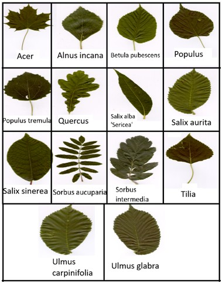
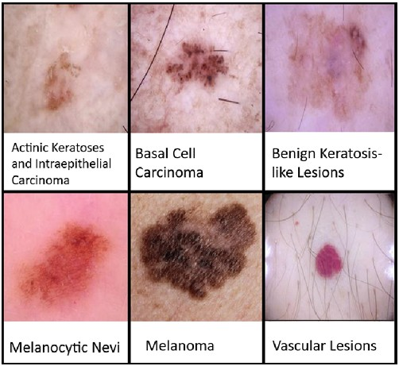
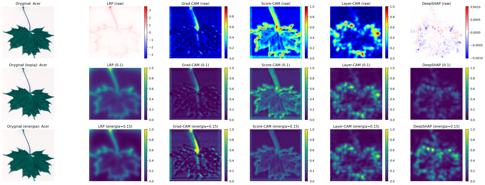
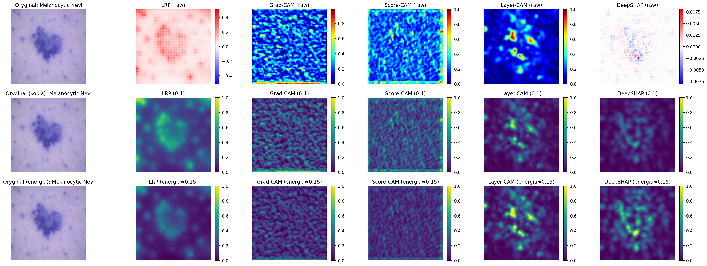
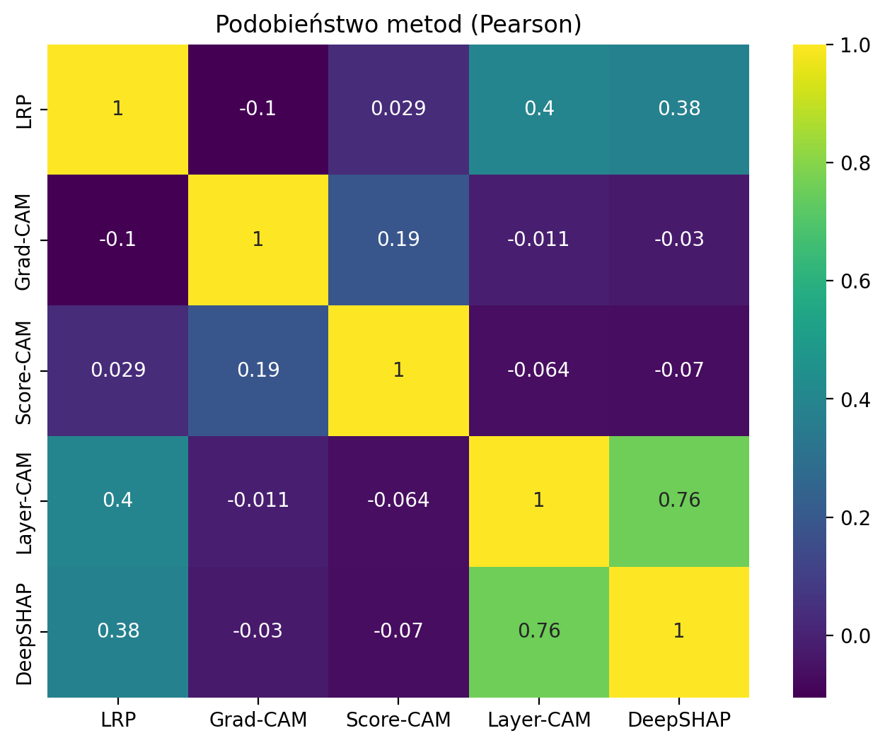
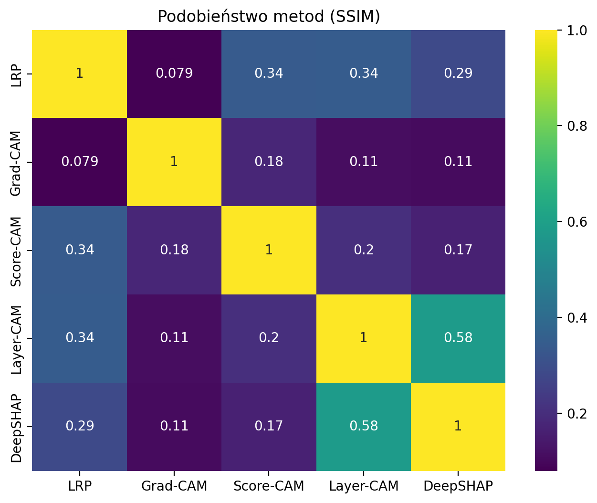

# XAI-Leaf-Skin: Interpretowalna Klasyfikacja Obrazów

**XAI-Leaf-Skin** to system oparty na sieciach głębokich (**ResNet34**), który zajmuje się klasyfikacją obrazów w dwóch domenach: dendrologicznej oraz medycznej. Projekt kładzie szczególny nacisk na **wyjaśnialność modelu**, wykorzystując zaawansowane metody XAI do wizualizacji cech obrazu determinujących decyzje modelu.

---

## Project Overview
Projekt realizuje zadanie automatycznego rozpoznawania obiektów na zdjęciach, wspierając użytkownika interpretacją wizualną w postaci map ciepła (heatmaps). System analizuje:

* **Bazę liści drzew**: Klasyfikacja 14 gatunków (m.in. *Quercus, Acer, Alnus*) na podstawie morfologii blaszki liściowej.

 
* **Bazę zmian skórnych**: Diagnostyka różnicowa m.in. czerniaka (*Melanoma*) oraz zmian naczyniowych (*Vascular Lesions*).

### Key Technologies:
* **Architektura**: ResNet34.
* **Interpretowalność**: Grad-CAM, Score-CAM, Layer-CAM, LRP, DeepSHAP.
* **Metryki XAI**: Entropia, Koncentracja Energii, SSIM, Korelacja Pearsona.
* **Środowisko**: PyTorch, Captum, OpenCV, Scikit-learn.

---

## 🛠️ Analyzed Methods (XAI)
Pierwszym i najważniejszym krokiem umożliwiającym rzetelne porównanie różnych metod XAI była 

**wielopoziomowa normalizacja wyników**. Ze względu na różną naturę matematyczną algorytmów (np. DeepSHAP generuje wartości ujemne, a CAM bazuje na dodatnich aktywacjach), zastosowano następujące techniki:

* **Ujednolicenie zakresu (0-1)**: Wszystkie mapy zostały poddane normalizacji Min-Max, co sprowadziło atrybucję do wspólnej skali $[0, 1]$, umożliwiając ich bezpośrednie zestawienie wizualne.
* **Normalizacja Energetyczna (Mean ≈ 0.15)**: Wprowadzono procedurę dopasowania średniej energii mapy do poziomu $0.15$. Pozwala to na obiektywne porównanie **precyzji (fokusu)** różnych metod – przy tej samej sumarycznej energii łatwiej wskazać algorytm, który lepiej izoluje obiekt od tła.
* **Korekta Szumu (Percentile Clipping)**: W metodach takich jak LRP czy DeepSHAP zastosowano obcięcie skrajnych wartości (99. percentyl), co zapobiega dominacji pojedynczych pikseli nad całą mapą wyjaśnienia.

## 📊 Analiza Statystyczna i Metryki Porównawcze
Aby obiektywnie poprzeć obserwacje wizualne, w projekcie zaimplementowano szereg ilościowych metod porównawczych. Pozwalają one na precyzyjne określenie stopnia podobieństwa między algorytmami XAI oraz jakości generowanych przez nie wyjaśnień.

### Podobieństwo Metod (Macierze Korelacji)
Poniższe macierze zestawiają ze sobą wyniki algorytmów pod kątem ich zbieżności strukturalnej i kierunkowej. Wykorzystanie tabeli pozwala na bezpośrednie porównanie różnych miar podobieństwa:

| Podobieństwo Cosinusowe | Korelacja Pearsona | Podobieństwo SSIM |
| :---: | :---: | :---: |
|  |  |  |
* **Podobieństwo Cosinusowe**: Mierzy zbieżność kierunkową wektorów atrybucji, ignorując ich skalę.
* **Korelacja Pearsona**: Określa liniową zależność między natężeniem ważności pikseli w różnych metodach.
* **SSIM (Structural Similarity Index)**: Analizuje podobieństwo struktur i tekstur na mapach, co jest kluczowe przy ocenie fuzji warstw w Layer-CAM.

### Ilościowe Metryki Jakości Wyjaśnień
Poza porównaniem metod między sobą, każdy algorytm oceniany jest pod kątem jego własności informacyjnych:

* **Entropia Mapy**: Pozwala ocenić stopień rozproszenia uwagi modelu. Niższa entropia świadczy o bardziej skoncentrowanym i jednoznacznym wyjaśnieniu.
* **Koncentracja Energii (Top-K)**: Mierzy, jaki procent całkowitej istotności (atrybucji) skupia się w $K$ najważniejszych pikselach. Metryka ta wskazuje, czy model rzeczywiście skupia się na obiekcie (np. zmianie skórnej), czy rozprasza uwagę na tło.

---

## 📂 Project Structure
* **`1.py` – Trening i Diagnostyka**: Inicjalizacja modelu oraz generowanie metryk (t-SNE, Confusion Matrix).
* **`2.py` – Analiza Warstwowa**: Narzędzie do wizualnego porównania metod CAM na różnych etapach architektury sieci.
* **`3.py` – Ewaluacja Metryk XAI**: Zaawansowany moduł obliczający twarde metryki jakości wyjaśnień oraz generujący zbiorcze porównania metod.

---

## 🚀 Getting Started
Projekt wymaga środowiska Python 3.8+ oraz bibliotek wymienionych w skryptach.

## ⚠️ Uwagi techniczne i status prac
Należy zwrócić uwagę na następujące aspekty dotyczące załączonych skryptów:

* **Status plików**: Kody zawarte w repozytorium nie stanowią ostatecznych wersji produkcyjnych. Wiele z nich w obecnej formie służy do generowania pojedynczych wartości diagnostycznych lub konkretnych metryk.
* **Generowanie wizualizacji**: Przedstawione w dokumentacji mapy ciepła i zbiorcze porównania zostały wygenerowane przy pomocy skryptów pomocniczych, które wykorzystują logikę zawartą w plikach `2.py` oraz `3.py`. Sama logika obliczeniowa, sposób normalizacji oraz podejście do atrybucji pozostają identyczne we wszystkich wersjach.
* **Kod po testach**: W plikach źródłowych znajduje się wiele funkcji i zmiennych, które nie są aktualnie wywoływane. Są to pozostałości po procesie badawczym, testowaniu różnych architektur sieciowych oraz eksperymentach z alternatywnymi podejściami do metod XAI.
* **Spójność metodologiczna**: Mimo obecności nieużywanego kodu, rdzeń algorytmiczny projektu (fuzja warstw w Layer-CAM, mechanizm LRP oraz procedury normalizacji) jest w pełni funkcjonalny i spójny z opisem teoretycznym.
